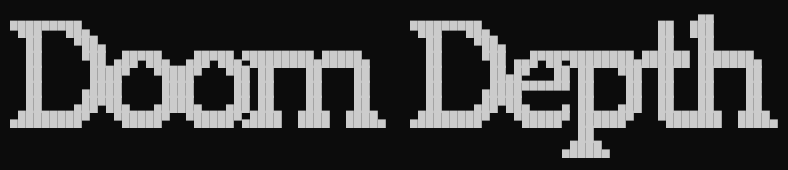

<p align="center">
    
</p>

[](https://github.com/Jayllyz/doomDepth/actions/workflows/formatter.yml)

Doom Depth game on terminal using C and Sqlite3. (Linux only)

## Run the project

### Clone

```bash
git clone https://github.com/Jayllyz/doomDepth my-project
cd my-project
```

### Build

```bash
make build
```

### Start

```bash
make start
```

> *Note: make start also run make build.*

### Exec

```bash
make exec
```

### Stop

```bash
make stop
```
